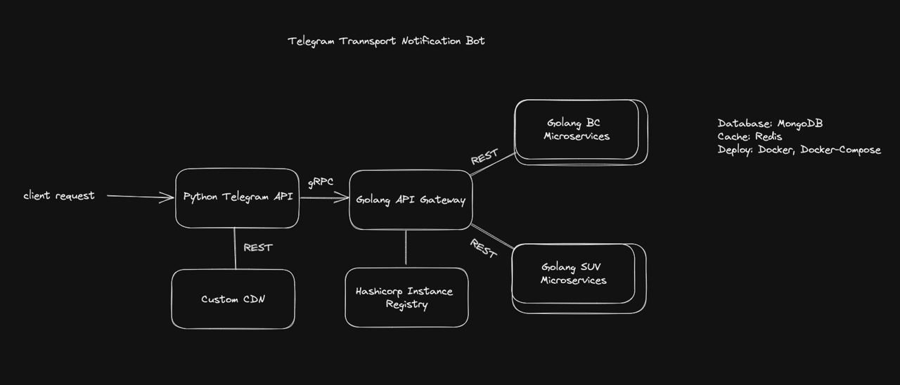

<h2></h2> 

<strong><samp>「</samp></strong>

   

      <samp>
         <em>💤 kitaTransportBot</em>
           
         <em>Modern telegram bot for notifying users about free transport tickets</em>
      </samp> 
   

   

      <samp>
         <em>Based on:<em>
           
         <a href="https://nextjs.org" target="_blank">Next.js</a> &#8226;
         <a href="https://tailwindcss.com/" target="_blank">tailwindcss</a> &#8226;
         <a href="https://firebase.google.com/" target="_blank">firebase</a>
      </samp>
   

<strong><samp>」</samp></strong>

<h2></h2> 

        

